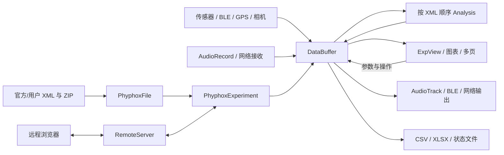
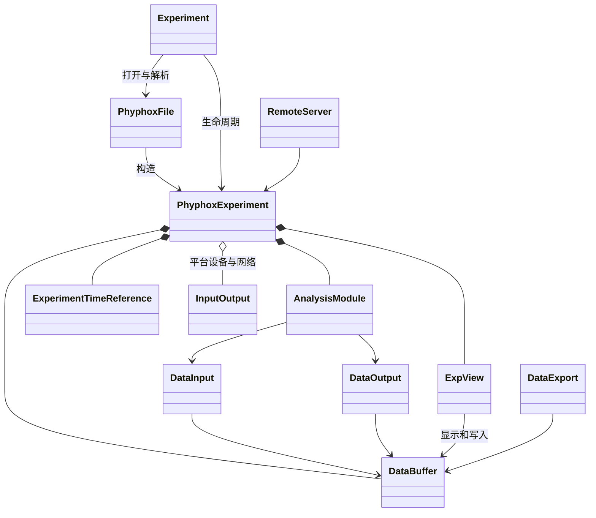
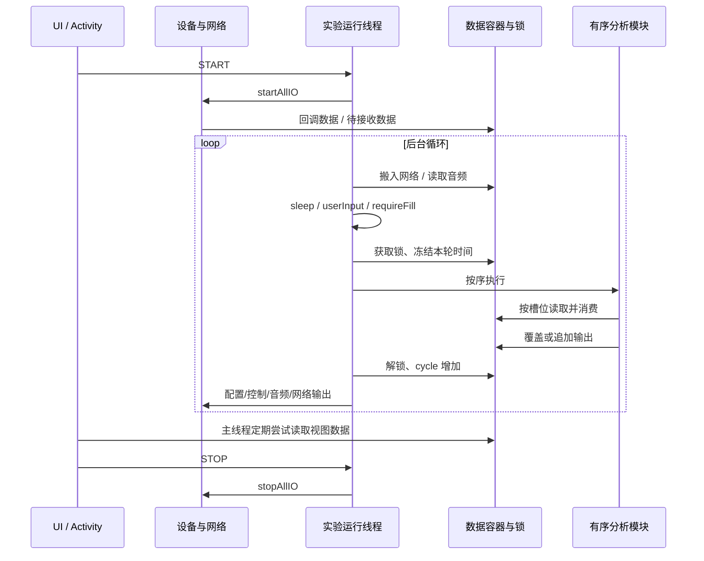
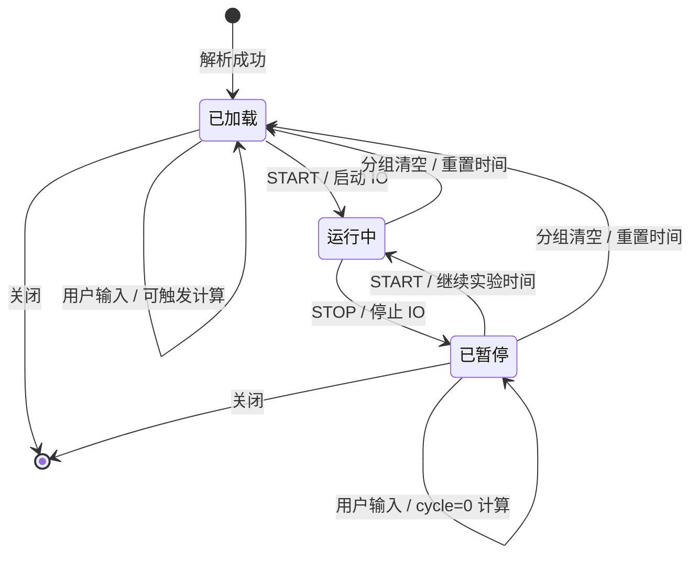

# phyphox Android 软件架构分析

分析基线：Android 1.2.1，实验格式最高 1.20。本文依据工作区干净的官方检出源码；不采用已有 AI 报告作为证据。标记【源码事实】为实现行为，【官方文档】为规范或测试资产结论，【移植建议】为本项目设计判断，【待验证】为尚无运行证据。本文没有执行 Android 构建、Android 真机测试或性能测试。

## 1. 固定版本与整体框架

| 资料 | 固定提交 | 用途 |
|---|---|---|
| phyphox/phyphox-android | `45fa55a0727653ccce439b86acb69c00cf435436` | 本报告的运行实现基线 |
| phyphox/phyphox-docs | `3dcfdae14f3c3a957208c367a026a0589f6dd702` | 格式、边界说明、计算和界面测试资产；包含更高版本条目，不一律纳入 1.20 |
| Staacks/phyphox-experiments | `af5c1a52a888426f0acff0284bb6a6564e113afb` | 官方实验定义、翻译、资源 |
| Staacks/phyphox-webinterface | `67c3ef3253cf3088e5f4079f82d3be2c90cbf47c` | 原版远程网页子模块 |

【源码事实】应用是以 Android Activity 为入口的 Java/Kotlin 应用，包含 JNI/C++ 数学和图形代码。`Experiment` 控制实验页面、用户操作和运行线程；`PhyphoxExperiment` 聚合运行数据和模块；`PhyphoxFile` 把 XML 转成运行对象。它不是可直接复制到 Windows 的独立实验 SDK。局部 CameraX/ViewModel/Compose 使用也不代表整个应用采用统一 MVVM。版本和 Android 平台基线见 [app/build.gradle](https://github.com/phyphox/phyphox-android/blob/45fa55a0727653ccce439b86acb69c00cf435436/app/build.gradle#L5)。

| 主要对象/模块 | 职责 | 平台关联 |
|---|---|---|
| ExperimentList / ExperimentRepository | 内置、用户实验和链接条目索引、分类、选择 | Android 存储、Activity 和资源 |
| PhyphoxFile | 版本与 XML 结构、容器引用、输入输出、分析、视图解析 | 工厂直接构造 Android 相关对象 |
| PhyphoxExperiment | 容器、分析序列、视图、设备、网络和时间基准的聚合根 | 仍直接持有 AudioRecord 等对象 |
| DataBuffer / DataInput / DataOutput | 样本、容量、初始化、静态性、消费/追加规则、通知 | 核心语义可移植；绘图缓存依赖平台 |
| Analysis / FormulaParser | 有序算子、公式、周期过滤、静态缓存 | 数学主体可移植，部分 JNI 必须替换 |
| ExpView / graphView 等 | 由定义生成原生控件、曲线和输入行为 | Android View/OpenGL；部分生成远程 HTML |
| SensorInput / GpsInput / Bluetooth / Camera / Audio | 真实采集与控制输出 | Android API 和真实硬件 |
| NetworkConnection / RemoteServer / DataExport | 外部网络收发、远程控制、数据与状态导出 | 协议可复用，服务与文件集成需重写 |

核心聚合字段见 [PhyphoxExperiment](https://github.com/phyphox/phyphox-android/blob/45fa55a0727653ccce439b86acb69c00cf435436/app/src/main/java/de/rwth_aachen/phyphox/PhyphoxExperiment.java#L112)。同一对象同时协调采集、计算与显示，移植时应保持其可观察语义，重新划分服务模块。

## 2. 从实验文件到运行对象

【源码事实】实验列表的轻量元数据扫描与打开后的完整解析是两层过程；“出现在列表”并不证明实验可运行。输入可能是内置资源、用户文件、ZIP 资源容器、链接，BLE 也可提供实验数据。`PhyphoxFile` 限定最高格式版本，并分派 `data-containers`、`events`、`views`、`input`、`network`、`analysis`、`output` 等块；分析模块按定义次序加入序列。见 [版本检查](https://github.com/phyphox/phyphox-android/blob/45fa55a0727653ccce439b86acb69c00cf435436/app/src/main/java/de/rwth_aachen/phyphox/PhyphoxFile.java#L79)、[根节点分派](https://github.com/phyphox/phyphox-android/blob/45fa55a0727653ccce439b86acb69c00cf435436/app/src/main/java/de/rwth_aachen/phyphox/PhyphoxFile.java#L1263)。

解析不仅读取标题：它建立命名容器、将每个模块槽位绑定到实际容器、解析常量和空输入、翻译和资源、配置硬件，以及创建交互控件。容器默认容量为 1；容量 0 表示可增长，不能把省略容量误解为无限。`init`、`static`、`clearGroup` 会影响整个生命周期。见 [容器与 events](https://github.com/phyphox/phyphox-android/blob/45fa55a0727653ccce439b86acb69c00cf435436/app/src/main/java/de/rwth_aachen/phyphox/PhyphoxFile.java#L1516)、[输入输出槽位](https://github.com/phyphox/phyphox-android/blob/45fa55a0727653ccce439b86acb69c00cf435436/app/src/main/java/de/rwth_aachen/phyphox/PhyphoxFile.java#L872)。

保存状态仍是 `.phyphox`：以原始实验为基础写入容器当前值、状态标题等以及 START/PAUSE 时间映射，不是进程内存快照，也不是完整设备通信回放。`events` 的 `experimentTime` 是秒，`systemTime` 是 Unix 毫秒；不能把它们当作同一种单位。见 [状态写出](https://github.com/phyphox/phyphox-android/blob/45fa55a0727653ccce439b86acb69c00cf435436/app/src/main/java/de/rwth_aachen/phyphox/PhyphoxExperiment.java#L662)、[events 解析](https://github.com/phyphox/phyphox-android/blob/45fa55a0727653ccce439b86acb69c00cf435436/app/src/main/java/de/rwth_aachen/phyphox/PhyphoxFile.java#L1557)。

【移植建议】文件导入必须依次区分：结构合法 → 引用和计算语义可支持 → 所需设备可绑定 → 交互可表达。缺少必要设备或算子应给出阻断原因，不可仅以 XML 加载成功声明完整兼容。ZIP 必须另做大小、路径穿越和资源路径限制。

## 3. 数据、计算、显示、导出闭环

【源码事实】传感器/BLE 回调、音频读取、网络接收和输入控件最终写入 `DataBuffer`。容器保存 double 序列（实现使用 LinkedList），有限容量保留新样本；还维护静态状态、最后值、图形缓存和时间引用集合。用户清空和算子消费是不同操作：`clear(true)` 重置初始化值与静态状态，`clear(false)` 只承担普通消费/覆盖语义。见 [DataBuffer](https://github.com/phyphox/phyphox-android/blob/45fa55a0727653ccce439b86acb69c00cf435436/app/src/main/java/de/rwth_aachen/phyphox/DataBuffer.java#L75)、[初始化及清空](https://github.com/phyphox/phyphox-android/blob/45fa55a0727653ccce439b86acb69c00cf435436/app/src/main/java/de/rwth_aachen/phyphox/DataBuffer.java#L326)。

每次 `processAnalysis` 先搬入网络待收数据、读取麦克风，再判断 `sleep` / `dynamicSleep`、`onUserInput` 和 `requireFill`。获得实验数据锁后冻结本周期时间，按 XML 顺序运行模块，随后增加 cycle。暂停状态的用户输入也可以触发计算，且该路径把 cycle 重置为 0。首轮 `requireFill` 例外不能省略。见 [完整周期](https://github.com/phyphox/phyphox-android/blob/45fa55a0727653ccce439b86acb69c00cf435436/app/src/main/java/de/rwth_aachen/phyphox/PhyphoxExperiment.java#L253)。

单个模块的细节决定计算兼容：

- 先按 `cycles` 判断是否执行；静态输出模块已执行时可以跳过，输入/输出重置通知会重新使其失效。
- **依输入槽位顺序读取并消费**。若两个槽位指向同一容器且第一个不 keep，第二个看到的就是消费后的内容；不能先复制所有输入再统一清空。
- 输出缺省覆盖，`append` 则追加；部分算子自行管理清空。完成后标记静态输出。
- 容器长度不等、空值、NaN、缺失输入、索引和范围行为属于算子语义，不可套用统一广播规则。

以上见 [AnalysisModule.updateIfNotStatic](https://github.com/phyphox/phyphox-android/blob/45fa55a0727653ccce439b86acb69c00cf435436/app/src/main/java/de/rwth_aachen/phyphox/Analysis.java#L273)。源码有 54 个分析入口，涵盖公式与标量运算、统计、微积分、序列/拼接/筛选/映射、插值、FFT/相关/周期检测、图像解码、事件流、时间与信息查询。公式拥有自己的词法、优先级、单值/数组索引和函数规则；不能把表达式交给 JavaScript `eval` 替代。见 [FormulaParser](https://github.com/phyphox/phyphox-android/blob/45fa55a0727653ccce439b86acb69c00cf435436/app/src/main/java/de/rwth_aachen/phyphox/FormulaParser.java#L533)。

计算后的缓冲区由视图读取，显示包含实时数值、曲线、多页视图、文本、图片和输入控件；按钮、切换、滑块、下拉、图表游标写回和控件默认值是实验逻辑的一部分。`updateViews` 尝试在短超时内获得锁，减少 UI 阻塞；视图刷新不等于采样频率。见 [视图更新](https://github.com/phyphox/phyphox-android/blob/45fa55a0727653ccce439b86acb69c00cf435436/app/src/main/java/de/rwth_aachen/phyphox/PhyphoxExperiment.java#L410)。

导出由实验定义的 export sets 指定列与数据源，可输出 CSV/ZIP CSV 和 XLSX，并支持时间/设备元数据。当前基线 Excel 输出使用自己的 `XlsxWriter`，不能根据旧版描述为 Apache POI/HSSF。见 [DataExport](https://github.com/phyphox/phyphox-android/blob/45fa55a0727653ccce439b86acb69c00cf435436/app/src/main/java/de/rwth_aachen/phyphox/DataExport.java#L41)、[ExcelFormat](https://github.com/phyphox/phyphox-android/blob/45fa55a0727653ccce439b86acb69c00cf435436/app/src/main/java/de/rwth_aachen/phyphox/DataExport.java#L299)。

【官方文档】数值差异和历史平台差异在 [inconsistencies.yml](https://github.com/phyphox/phyphox-docs/blob/3dcfdae14f3c3a957208c367a026a0589f6dd702/inconsistencies.yml#L1) 记录；FFT 原生精度和执行路径尤其不能因函数名称相同就声称逐位相等。【移植建议】明确数值容差与测试域，并把“格式、计算、设备、交互”分成四项兼容结论。

## 4. 线程、时间和生命周期

【源码事实】Activity 的后台 `updateData` 线程循环进行分析，循环含约 10ms sleep；主线程 Handler 处理输入与视图，运行时约 40ms、空闲时约 400ms 重排。采集 API 回调、BLE 协程/命令队列、网络任务、音频输出填充线程独立存在。`PhyphoxExperiment` 使用公平 `ReentrantLock` 协调共享数据；这些周期是调度策略，**不是实时性保证**。见 [后台和 UI 循环](https://github.com/phyphox/phyphox-android/blob/45fa55a0727653ccce439b86acb69c00cf435436/app/src/main/java/de/rwth_aachen/phyphox/Experiment.java#L1622)、[数据锁](https://github.com/phyphox/phyphox-android/blob/45fa55a0727653ccce439b86acb69c00cf435436/app/src/main/java/de/rwth_aachen/phyphox/PhyphoxExperiment.java#L132)。

| 时间 | 含义与使用边界 |
|---|---|
| 单调事件时间 | 来自设备/系统事件的单调时间，用于采样到实验轴的映射，不能与 Unix 时间直接相减 |
| experiment time | 只累计运行区间，PAUSE 时冻结，重新 START 继续 |
| linear time | 从起始系统时间算的连续时间，包含暂停；涉及壁钟的语义必须保留 |
| system time | 对外可读 UTC/Unix 时间，用 START/PAUSE 映射对应实验时间 |
| analysisTime / analysisLinearTime | 每轮分析入口取定，供本轮模块一致使用 |

映射与恢复见 [ExperimentTimeReference](https://github.com/phyphox/phyphox-android/blob/45fa55a0727653ccce439b86acb69c00cf435436/app/src/main/java/de/rwth_aachen/phyphox/ExperimentTimeReference.java#L67)。保存的恢复映射没有原进程单调计时点；不能通过“现在减去保存时间”猜测运行时长。末尾只有 START 而没有停止时点的状态文件，恢复方案必须明确未知区间。

启动进入 `startMeasurement` / `startAllIO`，建立时间事件并启用设备；停止进入 `stopMeasurement` / `stopAllIO`，关闭采集与输出而保留数据；清空先停止、按组重置数据并重建时间基准。无 clearGroup 的普通容器总被清空；未选择组保留；受保护的 `_` 组不应被普通清空选中。原生 Activity 退出/生命周期会停止测量，不能照搬成“关闭浏览器即停止 Windows 服务”。见 [启动](https://github.com/phyphox/phyphox-android/blob/45fa55a0727653ccce439b86acb69c00cf435436/app/src/main/java/de/rwth_aachen/phyphox/Experiment.java#L1769)、[停止与清空](https://github.com/phyphox/phyphox-android/blob/45fa55a0727653ccce439b86acb69c00cf435436/app/src/main/java/de/rwth_aachen/phyphox/Experiment.java#L1956)。

状态保存走后台 executor 并回主线程通知；Android 的保存操作会先停止测量。若 Windows 增加“运行中快照”，必须定义原子一致性和快照时点，不能声称原版天然提供该能力。见 [保存动作](https://github.com/phyphox/phyphox-android/blob/45fa55a0727653ccce439b86acb69c00cf435436/app/src/main/java/de/rwth_aachen/phyphox/Experiment.java#L1419)、[异步写出](https://github.com/phyphox/phyphox-android/blob/45fa55a0727653ccce439b86acb69c00cf435436/app/src/main/java/de/rwth_aachen/phyphox/PhyphoxExperiment.java#L622)。

## 5. 外部输入输出与平台边界

| 通道 | 【源码事实】实现方式 | 【移植建议】/硬件边界 |
|---|---|---|
| BLE | Android GATT，扫描选择、服务/特征、通知/指示/读轮询、配置与控制写入；队列串行化异步命令，处理超时与断连 | 重写为服务端 Windows BLE，保留 UUID、字节转换、配置/时间协议；真机与权限独立验收 |
| BLE 实验传输 | XML/ZIP 负载、长度及 CRC32 校验 | 协议可复用，不等于普通 BLE 设备自动支持该协议 |
| 音频输入 | AudioRecord，单声道浮点/PCM16 兼容路径，采样率输出与分块缓冲 | WASAPI 等服务端适配；实际采样率、延迟、增益/增强与输入输出设备均需验证 |
| 音频输出 | AudioTrack 填充线程，direct、tone、noise 插件 | 重做持续流和停机释放；浏览器不能承担测量时间基准 |
| HTTP / MQTT | NetworkConnection 映射发送/接收缓冲区与转换；HTTP 与 MQTT 服务；MQTT 为本基线自带 3.1.1 客户端 | 协议映射可复用，网络权限、TLS、错误、队列和停止策略重新实现；不是全部离线功能 |
| 手机传感器 | SensorManager 回调，传感器类型、精度、速率和时间映射 | 普通 PC 不默认具备；可由指定 BLE/USB 设备替代，必须重新声明单位/坐标/采样协议 |
| GPS | Android LocationManager GPS/网络提供器 | 需要 Windows 定位能力或外置 GNSS 协议；不能把 IP 定位等同于实验定位 |
| 摄像头 | CameraX/Camera2、OpenGL 分析，亮度/颜色/曝光/光谱等处理 | 普通相机只覆盖其真实功能；曝光与帧时间、ROI、像素处理需校验 |
| 深度相机 | DEPTH16 等专用采集链 | 普通 RGB 摄像头不能替代；要求具体深度硬件及 SDK |
| USB | 解析器没有通用 USB 实验输入适配层 | 新增能力：CDC/串口、HID、WinUSB/libusb、厂商 SDK 各有驱动和协议条件，不能统一假定兼容 |

关键证据：[BLE 命令队列](https://github.com/phyphox/phyphox-android/blob/45fa55a0727653ccce439b86acb69c00cf435436/app/src/main/java/de/rwth_aachen/phyphox/Bluetooth/BleCommandQueue.kt#L41)、[BLE 实验负载](https://github.com/phyphox/phyphox-android/blob/45fa55a0727653ccce439b86acb69c00cf435436/app/src/main/java/de/rwth_aachen/phyphox/Bluetooth/BluetoothExperimentLoader.kt#L29)、[音频读取](https://github.com/phyphox/phyphox-android/blob/45fa55a0727653ccce439b86acb69c00cf435436/app/src/main/java/de/rwth_aachen/phyphox/PhyphoxExperiment.java#L280)、[AudioOutput](https://github.com/phyphox/phyphox-android/blob/45fa55a0727653ccce439b86acb69c00cf435436/app/src/main/java/de/rwth_aachen/phyphox/AudioOutput.java#L201)、[NetworkConnection](https://github.com/phyphox/phyphox-android/blob/45fa55a0727653ccce439b86acb69c00cf435436/app/src/main/java/de/rwth_aachen/phyphox/NetworkConnection/NetworkConnection.java#L26)、[MQTT 客户端](https://github.com/phyphox/phyphox-android/blob/45fa55a0727653ccce439b86acb69c00cf435436/app/src/main/java/de/rwth_aachen/phyphox/NetworkConnection/Mqtt/MqttClient.java#L22)、[SensorInput](https://github.com/phyphox/phyphox-android/blob/45fa55a0727653ccce439b86acb69c00cf435436/app/src/main/java/de/rwth_aachen/phyphox/SensorInput.java#L310)、[GpsInput](https://github.com/phyphox/phyphox-android/blob/45fa55a0727653ccce439b86acb69c00cf435436/app/src/main/java/de/rwth_aachen/phyphox/GpsInput.java#L102)。另见 [CameraInput](https://github.com/phyphox/phyphox-android/blob/45fa55a0727653ccce439b86acb69c00cf435436/app/src/main/java/de/rwth_aachen/phyphox/Camera/CameraInput.kt#L49)、[DepthInput](https://github.com/phyphox/phyphox-android/blob/45fa55a0727653ccce439b86acb69c00cf435436/app/src/main/java/de/rwth_aachen/phyphox/camera/depth/DepthInput.java#L1)；不能由类存在推导为任意硬件可用。

原版远程网页通过 `RemoteServer` 的 get/control/set/config/export 等端点操作**手机内的实验实例**，计算与设备仍在手机。它能提供布局、交互和协议参考，但不能直接作为独立 Windows 引擎。见 [端点注册](https://github.com/phyphox/phyphox-android/blob/45fa55a0727653ccce439b86acb69c00cf435436/app/src/main/java/de/rwth_aachen/phyphox/RemoteServer.java#L542)。

## 6. 可复用资产、重写范围和验证依据

| 类别 | 可复用 | 必须重新实现或验证 |
|---|---|---|
| 格式和实验 | 官方 XML、翻译、单位、资源、BLE/网络描述 | 版本过滤、资源安全、平台能力检查；不能承诺每个内置实验可在 PC 运行 |
| 计算 | 算子与公式语义、参数和执行顺序、官方期望值 | C# 数值实现、JNI 替换、精度/空值/生命周期差异 |
| 状态和时间 | 容器 init、START/PAUSE 映射、分组清空约定 | 服务并发、原子快照、异常恢复、确定性回放属于新增设计 |
| UI | 原版橙色视觉、分页、图表与参数操作习惯；远程网页源码参考 | 浏览器组件、服务端输入指令、数据增量传输、真实设备状态展示 |
| 设备 | BLE 转换规则、协议 UUID、实验设备配置 | Android API 不可直接复用；Windows BLE/音频/相机和 USB 新适配 |
| 许可 | GPL 实验资源、上游源码和版权通知 | 派生源码及对应构建交付；新增依赖许可和商标独立审查 |

【官方文档】可优先复用 117 组分析 golden vectors、valid/invalid/generated 语法语料、11 个视图 fixture，以及容器归档、音频、BLE 和网络测试资料。使用前读取每组前提与期望；invalid 语料不等于 Android 当前实现全部拒绝，版本和已知例外必须分开。见 [测试矩阵](https://github.com/phyphox/phyphox-docs/blob/3dcfdae14f3c3a957208c367a026a0589f6dd702/test-matrix.yml#L1)、[corpus manifest](https://github.com/phyphox/phyphox-docs/blob/3dcfdae14f3c3a957208c367a026a0589f6dd702/corpus/manifest.yml#L1)、[视图说明](https://github.com/phyphox/phyphox-docs/blob/3dcfdae14f3c3a957208c367a026a0589f6dd702/fixtures/views/README.md#L1)。

【待验证】本报告的源码结论不等于设备或产品验收。Windows 真机 BLE、每类 USB 协议、声卡回路、相机/深度设备、不同盘符便携运行和长时间性能均应有独立记录。Windows 当前实现与阶段交付范围另见本目录 `IMPLEMENTATION.md`、`COMPATIBILITY.md` 和 `DEVELOPMENT-PLAN.md`；不能以模拟样本替代缺少的真实输入能力。

## 7. 架构与关键流程图

### 7.1 整体数据流



### 7.2 核心对象关系



### 7.3 一次运行周期



### 7.4 生命周期与两种时间轴



```text
墙钟 / linear time     0────────5────────10────────15
操作                   START    PAUSE     START     PAUSE
experiment time        0────────5·········5────────10
采集                   [ 运行区间 ]        [ 运行区间 ]
保留数据               ────────────────────────────
清空                   独立操作：按组恢复 init，重置时间
```
