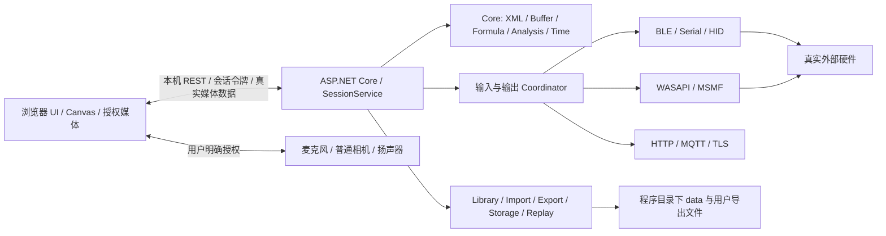

# Windows 完整开发与交付计划

> **最新需求基线（2026-09-18）**：用户明确允许麦克风、普通摄像头和扬声器使用浏览器授权能力，优先采用浏览器普通媒体入口，Windows 原生媒体保留为高级路径。这项指令覆盖旧版“浏览器只做 UI、全部设备由服务访问”的媒体限制。BLE、USB 串口/HID 仍由本地服务连接；实验解析、主分析计算、状态、文件保存和导出仍在服务内。浏览器媒体不等于硬件测量已验收，也不赋予普通相机曝光标定或深度能力。

## 1. 需求与决策基线

本计划以本任务用户指令和固定官方源码为依据，工作区既有AI方案不作为批准依据。尤其不采用旧材料中“网页直接访问BLE/USB、Electron必选”的假设：当前明确要求是**终端启动本地服务；浏览器负责界面与用户授权的普通媒体采集/播放，BLE/USB、实验计算和存储由服务负责**。本节采用顶部最新变更，不把旧“全部设备必须服务访问”继续施加于媒体。

已确认：独立离线运行、不依赖手机；BLE和USB必须有真实收发与必要控制输出；原版实验格式、计算与主要交互应移植；文件夹便携，不要求单EXE；普通4核8GB家用PC；优先Windows11 x64，同时尽量兼容Windows10；用户无外设，提供了Windows11 ARM虚拟机可验证x64仿真。

场景：教师从U盘在不同电脑启动并打开实验；研究/教学用户选择已知BLE或USB外设，导入原实验并配置采集；离线录制、分析、导出与独立回放；开发人员按协议新增设备profile。不能将一两个演示实验替代完整功能目标。

## 2. 方案比较与选择

| 技术路线 | 优点 | 成本/约束 | 结论 |
|---|---|---|---|
| C#/.NET + ASP.NET Core +浏览器 | WinRT BLE与Windows原生接口衔接；自包含部署；强类型领域代码；服务/协议/存储易隔离 | 数值行为需重写对照；原生依赖及每种OS仍须验证 | 当前实现采用.NET10，React/TypeScript负责UI及明确授权的普通媒体桥接 |
| Rust本地服务 + 浏览器 | 内存控制、独立二进制、设备适配可明确所有权 | 官方Java大量语义迁移、Windows异步及数值资产集成成本较高 | 适合后续性能热点的独立库，非当前整体重写理由 |
| Python本地服务 + 浏览器 | 数值生态、原型和脚本扩展方便 | 分发体积/原生wheel/启动和长期稳定性、并发边界需额外处理 | 可作为离线对照工具，不选主运行时 |
| Java本地服务 + 浏览器 | 一部分官方纯Java算法能接近直接复用 | Android类、JNI、设备与UI仍须替换；JRE与Windows设备绑定复杂 | 不因同语言就等于直接移植 |
| Electron/桌面壳 | 固定浏览器版本与窗口集成 | 多一套更新、缓存与分发责任；用户并不要求 | 当前无需桌面壳 |

降低.NET版本不能解决驱动、WinRT API、x64/ARM、相机组件和设备协议差异。当前不更改框架版本；发布携带运行时。Win10能否纳入“已支持”清单，以指定版本实测为准，不能靠TargetFramework名称判断。

## 3. 职责和模块边界

网页传送用户意图、明确profile和参数，不连接BLE/USB或解释其采样协议，不做主分析计算。媒体作为明确例外：浏览器持有经授权的MediaStream/AudioContext，上传真实单声道PCM和实际帧，播放服务生成的输出；服务负责ROI、算子、实验状态和持久化。普通媒体优先浏览器路径，Windows原生WASAPI/MSMF保留高级路径。服务负责实验生命周期与状态原子性；异步I/O不阻塞计算锁，输入在锁内写容器，分析按XML顺序执行，控制输出排队后由工作任务实际写入。

当前REST用于状态/实验库/快照/设备配置与命令，启动时bootstrap生成本机令牌；限制127.0.0.1、检查Origin/Host和跨站请求，不开放任意CORS。命令带requestId避免重复提交。后续增量推送仍复用同一会话状态与权限边界，不能让多个网页各自创建引擎。

## 4. 设计原则与当前实现

- 设备：交通层与型号协议分离；Serial/HID/WinUSB/厂商SDK条件分别说明；配置必须包含明确字段、帧、单位、时基与控制方式。设备断线/输入积压/解码失败显式报告，不补假值。控制写入不自动重放；中断后的执行结果可能不确定。
- 浏览器媒体：必须显式操作，报告实际采样率/帧尺寸、来源活动状态与权限失败；暂停保留授权并停止写测量数据，停止/清空/换实验撤销来源。媒体会话ID防旧流注入，有界批次与拥塞处理防无限排队；音频不能无声丢样伪装连续时间，后台节流/无输入应显式停机。不得将浏览器图像处理或原始音频等同已校准物理测量。
- 实验：安全XML、格式1.20、原版翻译/命名与容器语义；不将解析成功当可启动。缺少必要硬件或未实现属性时阻断对应运行。
- 计算：顺序模块执行、每输入依次快照和keep消费、输出append/static/cycle规则；保留NaN/Infinity；采用官方数值容差，不修改黄金答案。时间区分单调实验秒与UTC事件，恢复不推算不存在的时间戳。
- 展示：显示窗口当前最多20,000尾部样本，独立于完整存储/导出；图表交互只改变显示。不能用浏览器刷新次数作为实验时钟。
- 存储：源文件、导入映射、输入周期日志、暂停数据快照与导出分别保存；原子替换；清空不误删受保护组；回放不驱动设备。大数据流式存储/恢复策略仍需4C8G实测和改进。
- 便携：资源以AppContext.BaseDirectory定位，数据默认同目录；无绝对盘符写入配置；普通用户启动；保留完整文件夹和许可。系统驱动与浏览器是外部运行条件。

## 5. 复用与重写

直接复用：固定实验XML、图标/资源、格式结构和协议定义；官方docs黄金向量作为开发验证依赖，未确认语料分发授权前不装进产品。行为移植：公式、54模块、容器、时间、BLE转换/下载、音频混合、相机分析数学。重新实现：Android Activity/View/Canvas/OpenGL、SensorManager、BluetoothGatt、AudioRecord/Track、Camera2/深度、存储权限和前台服务。新增：USB协议适配、本机API安全边界、便携路径、Windows原生适配、浏览器授权媒体桥接、独立回放与部署验收。

许可/著作权、修改来源、第三方运行依赖见THIRD-PARTY-NOTICES。官方Android和remote网页不能直接编译成独立Windows服务。

## 6. 阶段、依赖与交付物

| 阶段 | 依赖 | 必须交付 | 当前状态/后续门槛 |
|---|---|---|---|
| P0 基线与源码分析 | 官方固定资料、用户约束 | 架构报告、完整能力表、四层兼容及待确认项 | 固定来源；设备矩阵仍待用户实物/协议 |
| P1 服务与便携基础 | P0 | 本机服务/API/UI壳、相对路径、用户数据隔离、便携启动 | 已有实现及ARM VM x64初轮验证；追加盘符/最终包验证 |
| P2 实验与计算 | P0/P1 | 安全解析、容器/公式/54算子、调度/时间、官方验证记录 | 117向量和解析语料通过；边界与Windows性能继续核对 |
| P3 设备闭环 | P1/P2、设备协议 | BLE/USB选择配置、真实输入/输出、异常和重连策略、profile样例 | 适配代码/组包检查已有；每个承诺型号必须实测 |
| P4 完整界面 | P2/P3 | 原版主要控件/图表/分页/主题、清晰能力诊断、实验管理 | 基本工作流已接；剩余交互清单逐项关闭 |
| P5 媒体与网络 | P2/P3 | 浏览器采集/播放与服务计算闭环、原生高级媒体、HTTP/MQTT、条件化相机支持 | 浏览器媒体本轮新增；网络本机协议检查已有，媒体实物/权限/时序/跨浏览器仍需验收 |
| P6 数据与恢复 | P2/P3/P4 | 导入、真实日志、回放/恢复、CSV/XLSX/state、断电/大文件策略 | 常用路径已接并核对；可控速回放/完整资源状态封装待补 |
| P7 完整验收与交付 | P1–P6、真实目标环境 | Windows10/11、两台电脑/U盘、性能/异常/设备验收、完整交付包 | 当前开发版；不能提前签署完整产品验收 |

不能隐式裁剪的未完软件项：完整graph与控件属性、定时运行、可控速逐帧回放、完整资源状态封装、实验复制/编辑/URL与二维码导入、设备profile持久化和重连全状态、原网络发现和远程协议边界、媒体非循环/动态无缝时序。以COMPATIBILITY逐项更新，不能仅凭“54算子”或少量样例宣布P7完成。

条件性新增而非无条件兼容：WinUSB控制/bulk、专有USB SDK、GNSS、深度、相机曝光与光谱校准。设备型号确定后单独报价/适配/验收。智能手机自带传感器无法在无相应电脑硬件时直接移植，允许显式外设替换，不允许模拟数据顶替。

## 7. 工作量估算与风险

以下为完整工程交付的规划估算，不是已花费工时：基线/契约5–8人日；服务/便携8–12；内核/差异验证15–25；BLE/两种明确USB设备12–20；完整视图/实验管理12–20；音频/网络/普通相机10–18；存储/回放8–14；实机、性能、许可与交付10–18。合计约80–135人日，另预留20%不确定性。可由内核、设备、UI并行，但统一集成与验收是串行门槛。已有代码降低部分实现工作量，尚不能用生成代码速度推定剩余验收成本；P3拿到实机后重新估算。

本轮浏览器媒体变更还需单列权限、生命周期、背压、播放同步、后台节流及不同浏览器的实测任务；原总估算不是此变更已完成或新增成本为零的依据，应在桥接实现和硬件验证后重估 P5/P7。

每增加一种有文档的普通USB协议，暂按3–10人日评估；复杂厂商SDK、高速采集或不公开协议不能套此数值。等硬件、驱动签署/许可、Windows环境准备不算有效开发日。

主要风险：文档与固定Android版本不一致→分别登记来源和行为；JNI/FFT精度差异→官方向量及关键实验实测；不同BLE驱动/MTU/重连→按适配器与固件建立矩阵；USB设备未知→协议门槛和独立适配；ARM仿真掩盖x64实机问题→保留架构标签；无限容器和快照大内存→4C8G压力测量后引入流式存储；音频/相机延迟与曝光→实际时钟/参数/标定，不使用伪造默认值；原生依赖许可→清点静态三方并移除未使用插件。

## 8. 验收与最终交付清单

优先官方语料、当前改动专项检查。真实BLE与至少明确的USB设备分别测：扫描/选择、连接、正确配置、已知输入对照、控制输出、拔插/占用/断线、重新绑定、长稳。需记录型号、固件、驱动、Windows版本、日志、预期和实际值。模拟/组包测试不可替代。

浏览器媒体另验授权拒绝/撤销、默认及指定输入、真实采样率/帧尺寸、暂停继续、关页/断流、输入拥塞/输出欠载、后台节流、音频回授与标定。Windows普通用户、未安装SDK/运行时、离线、含中文/空格路径、变盘符、只读/空间不足、两个实例、U盘安全退出分别验收。4C8G上测代表性BLE/音频/大缓冲组合的CPU、内存、刷新延迟、丢样、时钟误差与持续运行；阈值应按真实采样率和最大数据量冻结，当前不能编造性能通过数字。

数值以官方期望/容差为底线，实际硬件量测以仪器协议和校准数据为准。交互按每类控件/图形官方定义的观察结果核对；导出与完整容器比较，不能只验证文件非空。恢复/回放需比较结果与时基，明确不能恢复设备句柄。

最终完整交付应含：可运行Windows便携ZIP；相同版本源码与固定依赖/构建说明；使用说明；官方和自定义样例；每个已验设备的profile和协议引用；四层兼容矩阵；Windows/硬件/数值/交互/性能/异常验收记录；SHA256 manifest；GPL与必要第三方许可。当前开发验证包可供试用，不应被描述为这些门槛均已完成。
