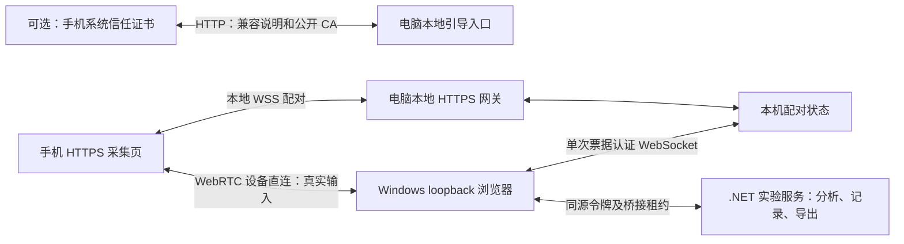

# 手机扫码接入 Windows 传感器：完整实施计划

日期：2026-09-19。用户补充硬要求：**完全离线，不配置公网域名或服务器**。本版已据此替换原在线配对假设。P0 软件验证版正在实现；硬件、浏览器证书提示行为与 Windows 实机验收仍是独立门槛。

## 1. 目标与默认决策

用户在 Windows 工作台的「设置 → 手机传感器」启用功能，手机扫描二维码，在浏览器中授权后成为实验输入来源。手机负责采集，Windows 本地服务继续负责实验计算、记录、回放和导出。

本方案采用**电脑本地托管手机页面、本地配对、设备直接传输**。电脑与手机只需处于可互通的局域网，打开页面、配对和采集均不需要互联网。普通 Windows 功能保持独立离线可用。

首版决策：

- 软件默认不开放局域网入口。用户在设置选择网卡并启用，程序自动分配 HTTP 引导端口和 HTTPS 采集端口，无需手输服务器参数。
- 默认直接扫描本地 HTTPS 配对二维码。出现证书提示时核对电脑 IP/端口，在浏览器提供选项时明确继续，再申请传感器权限；手机手动信任 CA 仅作为可选兼容办法，不是前置步骤。
- 生成临时配对二维码，指向电脑局域网 IP 的 HTTPS 页面；用户点击授权并在电脑确认。
- 初始验证版一次绑定一个输入，支持麦克风、普通相机、实际可用的加速度/角速度；多路并发保留为后续阶段。
- Windows 现有浏览器承接 WebRTC，.NET 服务继续分析和存储；本机管理 API 仍只监听 loopback。
- 手机本地 WSS 与电脑 loopback WebSocket 共享本机配对状态；没有云端信令、STUN 或 TURN。只接受 host 候选，网络隔离或防火墙仍可能阻止直连。
- CA 私钥仅保存在本机受限数据目录，不下载到手机。程序不自动修改系统证书信任、路由器或防火墙规则。
- 手机与电脑持有连接的页面须保持打开；不安装系统级虚拟设备驱动。
- Android、iPhone 的证书提示、继续访问行为、权限和真实采集必须实测；桌面浏览器检查不等于手机硬件验收。

## 2. 现有基础与实际改动范围

| 已有模块 | 可复用内容 | 必须补充的内容 |
|---|---|---|
| `web/src/App.tsx`、`api.ts` | 导航、会话状态、中文/英文、同源 API 调用 | 设置入口、手机设备状态、全局连接管理 |
| `BrowserMediaPanel.tsx`、`web/public/browser-pcm-worklet.js` | 用户授权、音频采集、相机参数与设备枚举 | 抽出共享采集模块、移动端生命周期、采样时间和端到端背压 |
| `Program.cs` | loopback 监听、Host/Origin 检查、本机令牌 | 新增受现有保护的手机桥接接口，定向允许配对服务的 WSS 连接 |
| `BrowserMediaEndpoints.cs` | 请求大小限制、输入校验入口 | 消除手机音频/图像共用全局单名额导致的互相拒绝，增加有界二进制接收路径 |
| `SessionBrowserMedia.cs` | PCM/图像校验、输入槽位映射、断流停机、ROI 分析 | 手机专用来源、采样时间映射、锁外图像解码、独立队列与完整来源记录 |
| `SessionService.cs` | 会话命令、缺设备诊断、记录与数据写入 | 运动输入适配、来源互斥、统一能力判断与启动屏障 |
| 现有存储和回放 | 保存输入、实验计算周期及结果 | 来源与时钟质量元数据；旧记录兼容 |

当前普通输入的缺设备判断主要依据通用设备绑定，不能仅在 UI 上显示“手机已连接”就认为实验可启动。须让会话能力检查真正识别手机输入，继续阻止缺失能力或未支持 XML 属性的实验运行。

当前相机解码与分析位于会话锁内。加入远程输入后，应把受限解码/ROI 分析放到锁外，提交前重新检查会话代次，避免图像处理长期阻塞音频写入和暂停命令。

## 3. 用户流程与界面

### 3.1 Windows 设置

新增轻量「设置」入口，包含「手机传感器」页。连接设备页和当前实验缺输入提示也可跳转到这里。

页面默认显示功能开关和简短说明：“全程局域网离线；扫码后按浏览器提示连接并授权。”启用后显示二维码、剩余有效时间、刷新按钮和复制连接链接。二维码本地生成，不请求第三方二维码网站。

临时配对二维码作为主入口；可选证书兼容说明单独展开，展示完整证书指纹。连接成功后，以设备卡片替换配对二维码主区域，包含：用户可修改的名称、连接状态、可用输入、授权状态、实际采样率/帧率、数据质量提示、断开按钮。设备名称由用户填写或使用“手机 1”等默认值，不从浏览器标识推断准确型号。

高级信息中显示协议版本、连接路径、往返时延、队列与丢包/丢帧计数、时间同步不确定度。普通用户无需填写 IP、端口、UUID 或 JSON。

### 3.2 手机页面

1. 用系统相机扫码，在系统浏览器打开链接；内嵌浏览器不兼容时提示复制到 Safari/Chrome。
2. 显示连接目标和“连接到电脑”按钮；建立配对，电脑确认接入。电脑与手机显示相同短校验码辅助确认，短码不是认证密钥。
3. 显示所选实验需要的输入，按需提供“启用麦克风”“启用相机”“启用运动传感器”按钮。运动权限请求必须直接在对应点击事件中发起，避免异步链丢失用户激活。
4. 显示实际返回的数据和授权结果。API 存在但没有数据时显示“未收到此传感器数据”，不能默认可用。
5. 进入待机：显示“等待电脑开始”、活动传感器、简易数值/缩略预览和停止按钮。
6. 采集中显示连接状态、持续时间与质量异常。点击“停止采集”立即释放手机采集资源，并通知 Windows 停止依赖这些输入的实验。

手机不显示完整实验编辑与文件管理界面。首次连接建议采用“扫码 → 手机连接 → 电脑确认 → 按需授权”，后续同一连接内切换实验不重复扫码，但新增权限仍由手机用户授权。

### 3.3 实验绑定

当前实验列出每个必需输入，用户从“电脑设备 / 手机设备”选择来源；唯一匹配时可以提出预选，开始前仍显示来源。手机以已有实验输入槽位接入，不要求修改所有 `.phyphox` 文件。

启动前检查：设备已连接、所需权限已授予、数据已实际到达、单位/字段满足要求、时间同步有效、没有来源冲突。运动传感器数值不能用于填补完全不同的传感器类型。

## 4. 首版能力边界

| 能力 | 首版安排 | 映射与限制 |
|---|---|---|
| 麦克风 | 必须交付 | 单声道 PCM、真实 AudioContext 采样率；波形/频谱；声压级需另做标定 |
| 摄像头 | 必须交付 | 默认 640×480、目标 5 fps；普通 ROI 亮度/颜色；前后摄像头按实际能力选择 |
| 含重力加速度 | 必须交付，设备须实际提供 | `accelerationIncludingGravity` → `accelerometer`，m/s² |
| 角速度 | 必须交付，设备须实际提供 | `rotationRate` → `gyroscope`，按轴转换及 deg/s → rad/s；缺失分量禁止绑定三轴实验 |
| 不含重力加速度 | 条件支持 | 浏览器实际提供 `acceleration` 才启用；不得默认用简易滤波冒充 |
| 姿态角预览 | 可选，不阻塞首版 | 先用于手机预览；欧拉角不能直接填入原版姿态四元数槽位 |
| 重力、原版 attitude 输入 | 后续 | 需定义坐标、派生算法、精度与质量标记并专门验证 |
| GPS、磁场、光照、气压、接近、温湿度 | 不在首版承诺中 | 按平台实际 API 和实验语义独立评估；不以设备“有硬件”推断网页可读 |
| 深度、手动曝光、标定光谱、高速视频 | 不在首版范围 | 不把普通图像包装为这些能力 |

运动接口的安全上下文、权限、空分量和坐标定义参考 [W3C Device Orientation and Motion](https://www.w3.org/TR/orientation-event/)。麦克风与相机的约束只是请求，应读取实际设置并验收：[W3C Media Capture and Streams](https://www.w3.org/TR/mediacapture-streams/)。

最低交付组合：各类单独运行、音频＋运动、相机＋运动。三路同时开启列入专项实测，未通过时界面明确限制组合，不能暗中降低音频完整性。相机自动降帧必须展示实际参数并记录变化。

## 5. 完全离线连接架构

### 5.1 为什么仍需 HTTPS

二维码指向电脑 IP 完全可行，但普通局域网 HTTP 不是浏览器认可的安全上下文。麦克风、相机和部分运动权限不能依赖它；localhost 的例外仅适用于访问设备本身。参见 [W3C Secure Contexts](https://www.w3.org/TR/secure-contexts/)。

离线 HTTPS 使用软件生成的本机 CA 签发含当前 IP SAN 的服务器证书。默认先验证浏览器内的证书提示继续访问路线，不把手机系统安装 CA 设为前置条件；继续后的接口暴露、授权与真实数据分别验证，不能承诺所有 Android/iOS 版本通用。

依据：[WebKit 已移除 getUserMedia 证书专项检查](https://bugs.webkit.org/show_bug.cgi?id=205493)，其当前[安全上下文判断](https://github.com/WebKit/WebKit/blob/main/Source/WebCore/dom/Document.cpp)和 Chromium 的[权限来源检查](https://github.com/chromium/chromium/blob/main/components/permissions/permission_context_base.cc)支持先检验浏览器行为。当前手机实机结果待补，源码不能代替验收。

最小验证使用 HTTP 和 HTTPS 两端口的 `/sensor-check.html`，不需要配对码、不接入实验、不上传数据。比较安全上下文/API 可见性，再主动请求麦克风、摄像头、运动权限；只有取得真实采样、预览、有效事件分量才记为对应项成功。

### 5.2 独立 LAN 网关与证书

用户从真实连接的私有 IPv4 网卡中选一个地址。独立 Kestrel 网关在该地址启动两个随机空闲端口。HTTP 提供 `/setup`、引导资源、公开证书、iOS 安装描述文件及独立诊断页 `/sensor-check.html` 和 `/sensor-check.js`；HTTPS 提供手机页面、静态资源、健康检查、手机信令及同一独立诊断页。原有实验管理、文件、导出和 bootstrap 令牌不暴露到 LAN。

CA 持久保存在 `data/phone-certificates`，限制当前用户读取私钥文件；初始有效期 2 年。每次启用为当前 IP 签发最长 30 天的叶证书，适应 IP 变化，不需要为每次换 IP 重装同一 CA。损坏或过期证书不自动覆盖，明确说明更换后浏览器可能重新提示，曾安装旧 CA 的手机需重新核对信任。软件不自动给电脑系统安装 CA。

可选 CA 安装通过 HTTP 引导分发公开证书；选择安装时必须将指纹与电脑界面显示的完整 SHA-256 对照。引导说明 Android CA 安装入口、iOS 描述文件安装及完全信任开关；它不阻挡默认 HTTPS 配对二维码。具体浏览器提示和机型差异写入验收记录。

停止局域网入口会撤销配对、停止依赖手机的采集并关闭端口；退出软件同样关闭。不自动开放防火墙；Windows 若提示访问，用户只按自己的局域网策略授权，不引导关闭整个防火墙。

### 5.3 本机配对与授权

随机房间与至少 128 位熵的一次性加入凭证，二维码 120 秒有效、电脑确认 60 秒有效。凭证放 URL fragment，手机读取后清除，仅存内存；本地生成二维码，不调用第三方网站。双手机抢占只允许一次成功，拒绝或过期后重新生成。

电脑浏览器在现有认证 API 领取 10 秒一次性信令票据，通过同源 WebSocket 的首帧认证；票据绑定当前桥接租约。手机不能获得电脑主令牌。信令仅允许有界 SDP/ICE 字段，不转发任意数据。每个手机帧在本机服务继续验证来源、实验、运行代次、长度与数值。

### 5.4 直连与网络故障

WebRTC 不配置外部 ICE 服务，检查候选与最终选中路径；禁止静默启用公网中继。host 候选不能证明物理网段，所以界面准确说明“设备直接传输”。同 Wi-Fi 若有访客隔离或禁用 UDP，依旧会失败，应给出可理解诊断。

信令连接结束不主动中断已建立的数据连接；真正关页、断网或数据超时会停止实验。全过程离线必须在手机移动数据关闭、路由器外网断开的真实环境中验收，不只观察当前代码没有云域名。

## 6. 数据协议、接收与背压

### 6.1 协议结构

协议版本从 `1` 开始，控制消息用带固定类型的 JSON，批量样本与图像用有界二进制格式。消息头包含版本、连接代次、运行代次、streamId、sequence、时间基准、payloadLength 和对应的采样数/帧标识。字段宽度、字节序、小数表示、最大值在 P1 的协议文档冻结。

首版控制消息包括 `hello / capabilities / configure / ready / start / started / pause / stop / ping / pong / ack / fault`。每条变更命令带 requestId，重复发送不重复启动硬件。

区分四层身份：配对连接、实验实例、每次开始/继续的运行代次、传感器流。手机重载、重配对、实验重载和清空必须使相应旧数据失效，即使再次加载同名实验也不能误收。

### 6.2 通道及流量策略

| 通道 | 默认策略 | 背压与异常行为 |
|---|---|---|
| control | 可靠有序 | 小消息、独立限流；ACK 区分手机收到、本机服务接受 |
| motion | 可靠有序、20–50 ms 批次 | 逐样本时间与序号；积压、超时或丢批次时终止当前依赖流的测量 |
| audio | 可靠有序、目标 20–40 ms PCM 批次 | Float32 单声道；按样本位置校验连续性；不静默丢样、补零或重排时间 |
| camera | 有界分片、允许丢弃过时整帧 | 首版保留至多一个待发和一个重组帧；重组过期整帧丢弃并计数 |

通道分开并不保证带宽隔离，同一 SCTP/网络连接仍可互相影响。相机优先降帧或跳帧；音频拥塞时停止测量。若 P0/P4 证明图像影响音频，再考虑独立 PeerConnection，不一开始增加复杂度。

每个消息分片不超过协商的 SCTP 最大消息大小，初始实现上限 16 KiB；重组总大小、片数、并发帧数和超时均受限。拒绝异常长度、非有限运动数值、越界 PCM、错误 MIME/尺寸和未知流。

手机和 Windows 桥接器均检查 `bufferedAmount`，服务为每个流提供有界队列。初始音频队列预算 500 ms，运动 250 ms，图像 1 帧；阈值超限按策略显式处理。最终 ACK 只有在本机服务接受数据后才能向手机推进，不能把“成功发到电脑浏览器”当作已经记录。

音频传测量 PCM，不用通话音轨解码后的有损数据充当原始波形。48 kHz × 32 位 × 单声道约为 192 kB/s，尚未计算协议开销。请求关闭回声消除、降噪、自动增益，并记录浏览器实际设置；无法验证关闭时显示处理状态未知。

图像优先复用受限 JPEG/PNG 和现有 ROI 管线，不引入实时视频解码后再截图的额外层。首版目标 640×480、5 fps，最高沿用现有限制 1920×1080、10 fps；是否开放高档位由实测决定。

### 6.3 本地服务接口草案

以下均位于现有同源、loopback、本机令牌保护之内，手机不能直接调用：

| 接口示意 | 用途 |
|---|---|
| `GET /api/v1/phone` | 功能设置、当前连接、能力和质量状态 |
| `POST /api/v1/phone/configure` | 启停功能、领取单个桌面桥接所有权租约 |
| `POST /api/v1/phone/attach` | 注册已确认的远端及其能力、协议版本 |
| `POST /api/v1/session/phone/bindings` | 验证并绑定实验输入槽位 |
| `POST /api/v1/session/phone/ingest` | 二进制批次，校验来源/代次/长度/时序，返回接受序号 |
| `POST /api/v1/phone/heartbeat` | 桥接生命周期与质量指标；不能代替真实数据新鲜度检查 |
| `POST /api/v1/phone/disconnect` | 撤销流并停止依赖该手机的实验 |

初版使用每流串行、持久 HTTP 连接的批量上传，避免每个运动样本单发请求；只有性能证据表明不够时，再采用同源 WebSocket 二进制桥接。若改 WebSocket，仍需 Origin 校验及短期专用握手凭证，不把本机主令牌放 URL。

## 7. 测量时间、单位与实验正确性

不能用电脑收到网络包的时间代替所有采样时间，也不能用浏览器刷新帧率当采样率。

- 手机运动样本记录其事件单调时间及批次序号；电脑浏览器与本地服务也使用各自单调时钟。
- 配对后用多轮四时间戳往返估计手机→电脑浏览器、电脑浏览器→本地服务的偏移与不确定度；初始采 8 轮，选择低 RTT 样本，每 10 秒更新。保存同步轮次、RTT、拟合参数和质量等级；网络不对称造成的误差不能被估计器完全消除。
- 对当前运行段冻结或平滑更新映射，禁止重同步造成已记录时间倒退。暂停后继续建立新运行段，不把暂停时间或暂停期间样本拼进原段。
- 音频波形内部时间由样本计数和实际采样率决定。AudioContext 时钟与 performance 时钟的关联需单独估计并记录；浏览器不能保证报告真实麦克风 ADC 起始时刻，不承诺音频与运动硬件级同步。
- 相机记录浏览器提供的帧时间及其语义；无法获得可靠帧元数据时使用读取帧时的单调时间并标为“读取时间”，不标成曝光时刻。可视预览丢帧与实验输入丢帧分别计数。
- 统一使用 m/s²、rad/s、秒等实验预期单位。固定采用设备自然坐标系；屏幕旋转仅改变显示，不暗中改变记录轴。轴映射和符号必须对照固定 Android 参考源码及真实摆放/旋转验证。
- 请求采样率与观测采样率分开存储；浏览器达不到实验要求时阻止该绑定或说明适用范围，不能伪造更高频采样。

首版适用于一般运动、声音频谱和图像趋势实验；精密跨传感器相位、传播时间、高速冲击和多设备同步不列入首版能力。不得只因为有时间戳就宣称毫秒级物理同步。

## 8. 生命周期与失败处理

连接状态：`disabled → pairing → confirming → connected → disconnected/expired`。输入状态：`unavailable / permission-required / denied / ready / capturing / fault`。实验运行状态仍由现有 SessionService 唯一管理，避免手机与电脑各自认为已开始。

| 场景 | 必须行为 |
|---|---|
| 开始 | 本地服务确认全部绑定，手机返回 armed/ready 后建立运行代次；只接受该代次数据；缺任一必要输入则失败 |
| 暂停/继续 | 暂停停止实验写入并清空队列；待机是否仍持有媒体轨道在手机明确显示；继续创建新运行代次，旧包拒绝 |
| 停止/清空/换实验 | 撤销采集流并释放媒体轨道，配对可保留；新实验重新绑定，禁止旧会话注入 |
| 手机停止或撤销权限 | 本地实验停机并保留已有记录，标注原因；不能切换成模拟值或电脑默认设备 |
| 手机息屏、后台或来电 | 尽快检测并停止依赖流的测量；恢复后重新检查权限/时间，不自动拼接成连续记录 |
| Windows 切换工作台页面 | 连接管理器挂在应用根部，不因 React 子页卸载而断连 |
| Windows 关闭/刷新持有连接的标签页 | 桥接租约与数据超时触发服务停机；重新打开需重新绑定，不承诺后台常驻采集 |
| 重复打开多个电脑标签页 | 服务只授予一个桥接所有权租约，其他页面只看状态；接管须先停止现有流 |
| 链路断开/队列超限 | 标明故障点与已接受序号；故障后不自动续采，用户确认后开始新段 |
| 信令断线但直连正常 | 当前采集继续，以设备通道与真实数据新鲜度检查驱动停机 |

初始传输心跳间隔 1 秒、3 秒未响应判失联；运行中每路数据新鲜度独立检查，绝不能因为心跳还在就忽略空流。启动的首数据宽限最长 5 秒，正常运行阈值结合预期频率与队列预算在 P0/P1 冻结。故障处理经过现有命令串行机制，保证只停机一次。

前台采集中尝试 Screen Wake Lock；失去可见性时释放、恢复后重新申请。Wake Lock 不保证后台或息屏持续采集，相关限制参考 [W3C Screen Wake Lock](https://www.w3.org/TR/screen-wake-lock/)。

## 9. 文件、记录与隐私

原有输入和计算结果沿用现有记录管线。新增可选来源元数据：`sourceKind=phone-browser`、用户设备名称、协议/前端版本、实际采样参数、权限/处理设置、坐标与单位、流代次、时钟拟合与不确定度、丢帧/故障和参数变更事件。

CSV/XLSX 等数值导出继续输出实验容器数据；需要时增加同包 metadata JSON，不将诊断字段混入样本列。旧记录缺少新元数据时仍可读。记录回放不连接手机、不申请权限，不把设备来源重新建立成实时绑定。

首版相机仍保存既有分析结果与来源信息，不自动承诺保存全程原始视频。原始图片连续归档、音频独立文件和保存配额应分别按既有导出能力及后续需求处理。

本机配对状态仅存内存；日志不记录令牌、完整 SDP、音视频或证书私钥。诊断导出移除加入凭证与密钥。数据目录备份中含本机身份私钥，应保留受限权限；移除手机上的信任证书有明确指南。

## 10. 代码组织与依赖

建议新增：

- `web/src/phone/PhoneSensorSettings.tsx`：Windows 配对与设备状态。
- `web/src/phone/PhoneBridge.ts`：全局连接、信令、通道、租约和本机转发。
- `web/src/capture/`：从现有面板抽出的媒体采集与运动采集模块，现有电脑采集入口继续使用。
- `phone-web/`：手机独立构建入口；复用采集与协议模块，不打包完整桌面实验 UI。
- `shared/phone-protocol/`：TypeScript 协议定义、编码和错误码；C# 类型保持相同版本与固定样例。
- `src/Phyphox.Server/PhoneEndpoints.cs`、`PhoneConnectionManager.cs`、`SessionPhoneInputs.cs`：接收、流量限制、会话绑定和时基映射。
- `src/Phyphox.Pairing/`：可复用配对状态与消息校验；Windows 本地网关在进程内复用，不要求用户部署服务。
- `docs/PHONE-PROTOCOL.md`、`docs/PHONE-DEPLOYMENT.md`、专项验收记录。

避免为了新增手机来源重写整个 DeviceManager 或实验引擎。先提取媒体输入中确实共用的校验/分析方法，保持电脑原有浏览器媒体行为，新增手机路径自己的时间和流身份。

二维码采用小型本地依赖，选型时检查许可、锁版本与包体积；WebRTC、Web Audio、运动接口使用平台 API。构建依赖更新同步现有许可清单。不在计划阶段安装依赖或部署外部服务。

## 11. 分阶段实施与验收门槛

以下为规划工作量，按一位熟悉项目的开发者估算，非交付日期承诺；真实设备与局域网验证环境等待时间另计。每阶段只运行当前改动相关检查，不重跑无关全量测试。

| 阶段 | 工作 | 交付物与过关条件 | 估算 |
|---|---|---|---|
| P0 可行性验证 | 独立 HTTP/HTTPS 传感器检查、本机证书提示行为、离线信令、host-only 直连；Windows Edge 接收；真实权限/时间探测 | Android Chrome 与 iPhone Safari 各完成真实扫码；PCM、图像、运动数据逐项到达；形成支持/失败证据；失败先修路线，不进入产品实现 | 3–5 人日 |
| P1 契约与本地接入 | 冻结协议、来源/运行代次、输入能力模型、队列与时钟；最小服务接收 | 实验正确收样；错误流、过期代次、非法值被拒绝；暂停后无旧包注入；协议文档 | 4–6 人日 |
| P2 配对与手机 UI | 设置入口、QR、确认、权限、状态、单标签桥接所有权 | 新用户无需手输参数走通扫码；拒绝/过期/双手机申请处理正确；本机服务不扩大监听 | 4–6 人日 |
| P3 运动输入闭环 | 加速度、角速度、轴/单位/时间、实验绑定 | 至少一个现有加速度实验、一个角速度实验正确运行并导出；缺分量明确阻断 | 3–5 人日 |
| P4 音频与图像闭环 | PCM、图像分片、ROI、各流背压、并发输入与锁外解码 | 音频/图像单路及承诺组合通过；时间语义与实际参数可查；过载按策略停机/丢帧 | 5–8 人日 |
| P5 实机交付 | 专项异常矩阵、性能、便携包、部署与用户文档 | 目标设备证据、Windows x64 包、版本兼容、来源记录、浏览器首次连接、可选证书安装/移除与本地入口关闭说明完整 | 4–6 人日 |

合计约 23–36 人日，建议预留约 20% 给移动端兼容和链路问题。先完成 P0 再重新估算；不能把浏览器样机当天跑通等同于完整产品已完成。P1 后首个可用里程碑为“扫码＋加速度/角速度实验闭环”，首版正式交付仍包含麦克风与普通相机。

### 11.1 最小必要自动检查

- 协议/会话：错误版本、重复/旧代次、超长或恶意分片、错误能力绑定、来源互斥、暂停继续、旧包注入和超时停机。
- 数据正确性：轴与 deg/s→rad/s 转换；PCM 样本计数和缺批次；时间映射单调性及暂停段；图像完整性与重组超时。
- 配对：令牌过期、一次性占用、电脑拒绝、租约重复接管；日志无凭证。
- 复用受影响的 `web/browserMedia.test.mjs` 和存储测试中的 `--browser-media` 专项；前端运行 TypeScript 检查/构建，C# 仅构建受影响项目并运行对应测试。
- 各测试针对可观察关键行为，不为每个组件、字段或私有函数机械增加测试。文档计划本身不运行软件测试。

### 11.2 必须完成的真实设备检查

记录手机型号、OS/浏览器完整版本、Windows 版本/架构、网络拓扑、实验配置和结果。目标基线是 Windows 11 x64＋Edge，手机 Android Chrome、iPhone Safari；Windows Chrome 做桥接兼容抽查。Windows 10 只有在现有产品仍承诺支持时另验本功能，未经实测不标已支持。

关键场景：首次授权/拒绝/撤销；二维码失效；前后摄像头；旋转手机轴验证；同一 Wi-Fi、电脑有线＋手机 Wi-Fi、热点；隔离网络失败提示；手机后台/息屏/来电；刷新或关闭电脑页；暂停继续/清空/重载同名实验；断网/换网络；已直连时仅中断公网；两手机竞争；带真实数据保存/回放/导出。

量测对照：静置加速度模长应与当地重力数量级相符；各轴定向翻转/旋转验证符号；音频用已知测试音验证主频和真实采样率；相机用固定颜色/区域变化验证映射。上述是功能正确性检查，不能代替计量标定。

### 11.3 首版质量目标（P0 后冻结）

| 项目 | 初始目标/判定方式 |
|---|---|
| 连接耗时 | 排除用户点击和权限等待，参考网络下 10 次中至少 9 次在 15 秒内达到连接就绪；记录失败原因 |
| 运动输入 | 请求目标 50 Hz；显示观测频率/抖动，设备不足时按实测声明，不伪造 50 Hz |
| 音频 | 至少一种真实浏览器采样率稳定工作；实验要求不匹配时明确拒绝或使用已有合法 rate 输出 |
| 相机 | 默认 640×480、目标 5 fps，显示实际帧率；丢帧可解释且可计数 |
| 展示延迟 | 普通运动曲线参考目标 p95 ≤250 ms，记录测量方法与时钟估计误差；不作为采样同步精度 |
| 断流响应 | 收到关闭/权限撤销立即处理；无事件时在配置的心跳或输入新鲜度门限内停机 |
| 稳定性 | 每个平台用一个代表性承诺组合运行 30 分钟；不出现未解释丢样、无界队列增长或旧段注入 |
| 性能 | 4 核/8 GB 参考电脑记录 CPU、内存、队列水位和控制响应；产品阈值根据 P0 实测冻结，不预写“已达标” |

三路组合不通过时可交付明确限制组合的首版，但麦克风、相机和核心运动输入任何单项在目标平台未通过，都必须披露平台限制或延期该平台，不能笼统称“全部传感器支持”。

## 12. 后续路线与范围

完全离线是主路线，不作为付费部署或后续可选项。初始软件验证版优先完成单输入；再逐步完成二进制分片、多路并发、时间同步不确定度与更完整的测量元数据。三路实时采集和精密跨传感器同步不能提前承诺。

本次范围严格限于手机浏览器，不规划原生伴随应用。先验证默认扫码打开本地 HTTPS 后的浏览器提示和真实采集；失败时记录具体平台限制，可选证书信任不作为默认强制步骤。

## 13. 交付与当前实施状态

普通用户操作为：打开 Windows → 设置/手机传感器 → 选择局域网地址并启用 → 扫临时配对码 → 按浏览器提示继续（如出现）→ 手机授权 → 绑定实验输入。无需配置公网服务、域名或运行开发命令。

最终交付包括 Windows 便携包与校验值、随包手机网页/本机配对模块、首次浏览器连接与可选证书安装和移除指南、协议与错误码、明确能力矩阵、实机及故障验证记录、依赖许可与版本记录。旧云端部署草案已被本版离线要求替换。

当前代码推进到 P0 软件验证版：离线网关与证书引导、临时配对、单路运动/PCM/普通图像接入和生命周期防护。当前传输使用有界 JSON，运动时间为首样本相对本段对齐、相机时间为服务接收时刻；后续二进制、多路调度与精密时间映射仍按计划实施。不能把当前原型当作全部阶段完成。

P0 真实门槛仍需 Android、iPhone 和 Windows 机器：浏览器证书提示及继续后的结果、实际权限与数据、同局域网直连、断公网持续采集、保存数据和异常停机。没有这些证据，不标记 P0 硬件验收通过。
